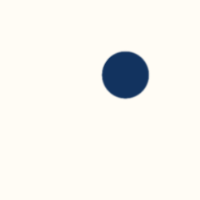

<!-- PROJECT LOGO -->

<h1 align="center">
 

 Data Point 
</h1>

<h4 align="center">my personal website</h4>

<a href="https://apivahnenko.github.io/datapoint/">Visit Site</a>
·
<a href="https://github.com/APIvahnenko/datapoint/issues/new?labels=bug&template=bug-report---.md">Report Bug</a>
·
<a href="https://github.com/APIvahnenko/datapoint/issues/new?labels=enhancement&template=feature-request---.md">Requests</a>

<!-- 

  

 -->

<!-- TABLE OF CONTENTS -->

  
Table of Contents

  <ol>
    <li><a href="#about-the-project">About The Project</a></li>
    <!-- <li><a href="#roadmap">Roadmap</a></li> -->
    <li><a href="#acknowledgments">Acknowledgments</a></li>
  </ol>

<!-- ABOUT THE PROJECT -->

## About The Project

Author & Creator: [Anna Ivahnenko](anna.ivahk@gmail.com)

This site is a way for me to showcase my work and it gives me a reason to improve my skills and understanding. I'm a visual person, who still learning a lot about this world and finds it interesting. I hope you will find something interesting here for you.

(<a href="#readme-top">back to top</a>)

<!-- ### Built With

This section should list any major frameworks/libraries used to bootstrap your project. Leave any add-ons/plugins for the acknowledgements section. Here are a few examples.

- [![Next][Next.js]][Next-url]
- [![React][React.js]][React-url]
- [![Vue][Vue.js]][Vue-url]
- [![Angular][Angular.io]][Angular-url]
- [![Laravel][Laravel.com]][Laravel-url]
- [![Bootstrap][Bootstrap.com]][Bootstrap-url]

(<a href="#readme-top">back to top</a>)
 -->

<!-- ROADMAP 

## Roadmap

- [ ] Optimisation
- [ ] Backend

See the [open issues](https://github.com/APIvahnenko/datapoint/issues/new?labels=bug&template=bug-report---.md) for a full list of proposed features (and known issues).

(<a href="#readme-top">back to top</a>)
 -->

<!-- ACKNOWLEDGMENTS -->

## Acknowledgments

Resources I found helpful and would like to give credit to:

- [GitHub Pages](https://pages.github.com)
- [Malven's Flexbox](https://flexbox.malven.co/) and [Grid Cheatsheet](https://grid.malven.co/)
- [Google Fonts]()

(<a href="#readme-top">back to top</a>)

---

> [datapoint](https://apivahnenko.github.io/datapoint/) &nbsp;&middot;&nbsp;
> GitHub: [@APIvahnenko](https://github.com/APIvahnenko) &nbsp;&middot;&nbsp;
> Email: anna.ivahk@gmail.com
